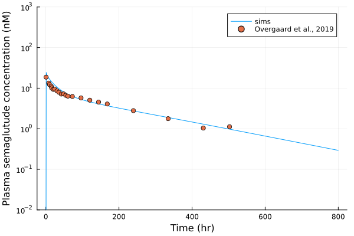

# pbpk-semaglutide

## Implement PBPK model of albumin 

Model was published in [Liu et al, J Pharmacokinet. Pharmacodyn, 2024](https://pubmed.ncbi.nlm.nih.gov/38691205/).

## PK simulation for semaglutide

We demonstrate this model is capable of predicting the PK of semaglutide, a 4.1kDa small peptide. The binding and unbinding rates between semaglutide and albumin was tuned, as the author could not identify these 2 parameters based on public information. The simulated semaglutide PK was compared to the IV PK described in [Overgaard et al., 2019](https://pubmed.ncbi.nlm.nih.gov/30788808/).

<table>
    <tr>
        <th> Figure 1. Plasma PK of semaglutide, human </th>
    </tr>
    <tr>
        <td>  </td> 
    </tr>
</table>

