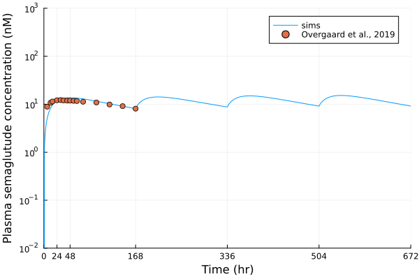
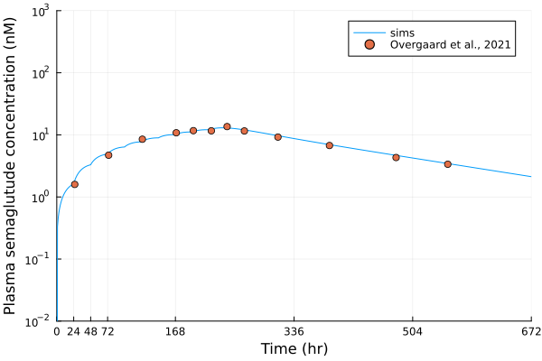

# pbpk-semaglutide

## Implement PBPK model for peptide/ albumin 

Model was published in [Liu et al, J Pharmacokinet. Pharmacodyn, 2024](https://pubmed.ncbi.nlm.nih.gov/38691205/).

## PK simulation for semaglutide

We demonstrate this model is capable of predicting the PK of semaglutide, a 4.1kDa small peptide. The binding and unbinding rates between semaglutide and albumin was tuned, as the author could not identify these 2 parameters based on public information. The simulated semaglutide PK was compared to the PK described in [Overgaard et al., 2019](https://pubmed.ncbi.nlm.nih.gov/30788808/) and [Overgaard et al., 2021](https://pmc.ncbi.nlm.nih.gov/articles/PMC8505367/). 

<table>
    <tr>
        <th> Figure 1A. Plasma PK of semaglutide (IV) </th>
        <th> Figure 1B. Plasma PK of semaglutide (SC) </th>
        <th> Figure 1C. Plasma PK of semaglutide (oral) </th>
    </tr>
    <tr>
        <td>  </td> 
        <td>  </td> 
        <td>  </td> 
    </tr>
</table>

## Computational Infrastructure 

- julia 1.11.5